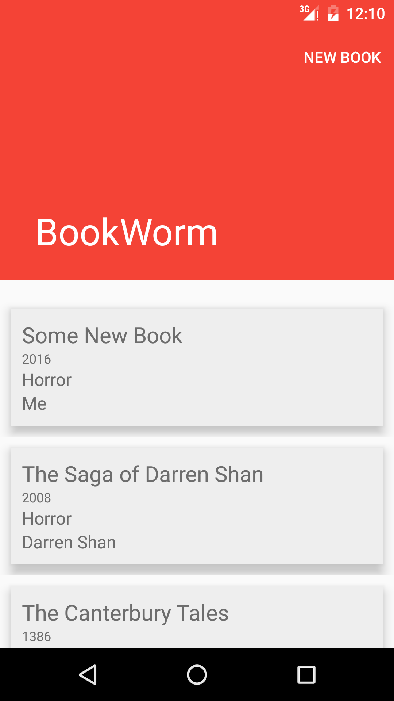

BookWorm
========

###Summary:
BookWorm is a mobile application that is a "Library" of books that the user has. It display the list of books that the user owns and lets the users add more books to the library.

###Screens:
BookWorm contains the following screens:

####Screen 1:
It displays the books that the user currently has on a recyclerview. There is an included json file books.json in the assets folder that contains the default list that may be changed. If no books are currently found in the database, the app loads the default list into the database. There is a New Book button on the titlebar that lets users add a new book which transitions to Screen 2. The list of books are scrollable as well as clickable. Regular click will load the book on a new view where as long clicking a book will open a snackbar prompt confirming the deletion of the book.

####Screen 2:
This is the Interactive screen. The user is able to add a new book provided all the fields (title, year of publication, genre and author) are filled out. The user may decide to go back and forfeit any data that is input but not persisted. Data validation is done on a regular basis even through orientation change. A visual que is provided as well as a descriptor for what the validation rule is for each of the fields. When the CAT button or the Floating Action Button is pressed to save the book. It ensures that all the data is valid before allowing to save the book. A generic message is provided via the snackbar redirecting the user to the individual fields. If everything is good and the book can be saved, the book is saved and the activity is closed and then the newly added book is on the top of the list.

####Screen 3:
This is the view book screen. The app just seemed incomplete without this implementation so I decided to add the view. When the user clicks a book, a new view opens up that shows the details of the book. There is no more information than what was provided on the recyclerview. However the font size is bigger and clearer here.

####Build instructions:
There is a pre-configured gradle wrapper included in the project. The project can be built using `./gradlew assembleDebug` command. The `.apk` file will be located in `app/build/outputs/apk` and named `app-debug.apk`. It can then be installed in the phone.

####Screenshots:

